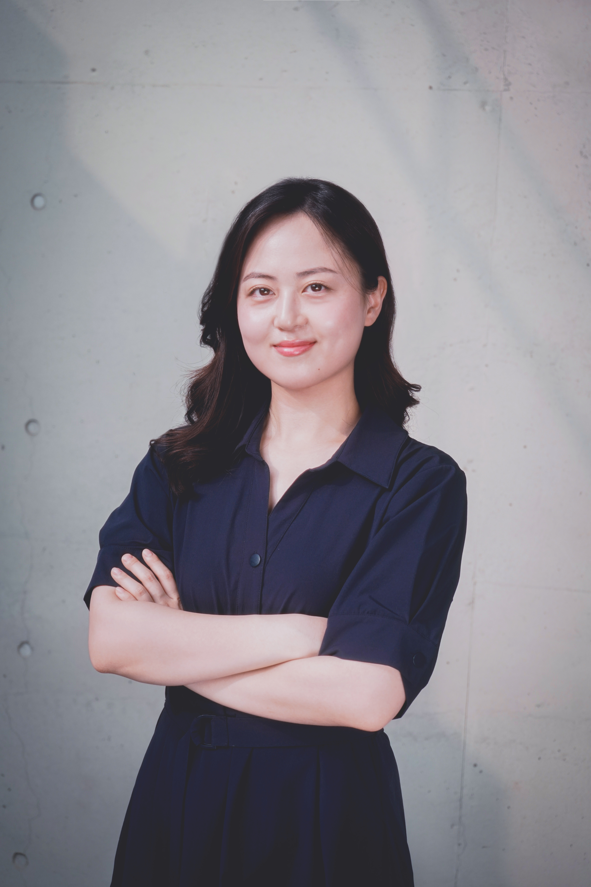

  
  
Hi, I'm Minjeong! I'm an HCI researcher interested in human-centered AI and technology adoption across generations.

## About Me
I am an HCI researcher passionate about designing and evaluating human-centered technologies. My research interests lie in understanding how people interact with technology and how we can make these interactions more intuitive and accessible.

With experience spanning research, design, development, and marketing, I enjoy working at the intersection of technology and human behavior. I have conducted user interviews, designed prototypes, and collaborated with multidisciplinary teams to explore innovative solutions.

In addition to my technical and research skills, I am fluent in multiple languages, including English, Spanish, and French, allowing me to engage with diverse perspectives and global audiences. I thrive in collaborative environments, taking on both leadership and supporting roles to drive projects forward.

Originally drawn to the gaming industry, I became more fascinated by how people form relationships and engage with technology through games, which led me to pursue HCI research.

## Research Interests
- Conversational AI & UX
- AI-Assisted Help Systems

## Education

  
Sep 2024 - Current

  
<b>Seoul National University</b> Master's Student, Human Centered Computing Lab, Department of Intelligence and Information 

  
Seoul, Republic of Korea

  
  
Mar 2019 - Aug 2024

  
<b>Seoul National University</b> Bachelor's degree, Hispanic Language and Literature, Information Science and Culture Grade: 4.1/4.3 Summa Cum Laude

  
Seoul, Republic of Korea

## Publications
[**CodeVoyager: An Interactive Tool for Rapid Code Comprehension through LLM-Assisted Graph Navigation**](https://dl.acm.org/doi/full/10.1145/3746058.3758378) Yeonjoon Kim, Kyochul Jang, Hyungwoo Song, _Minjeong Shin_, Bongwon Suh (UIST Adjunct '25)

[**"I feel you, but...": Exploring the Boundaries of Pragmatic Markers in Real-time Voice-based Conversational Agents**](https://dl.acm.org/doi/10.1145/3706599.3719797) _Minjeong Shin*_, Jaehoon Choi*, Hyungwoo Song, Junghwan Kim, Bongwon Suh, Extended Abstracts of the 2025 CHI Conference on Human Factors in Computing Systems (CHI EA '25) *contributed equally

[**AltAuthor: A Context-Aware Alt Text Authoring Tool with Image Classification and LMM-Powered Accessibility Compliance**](https://dl.acm.org/doi/10.1145/3708557.3716366) Hyungwoo Song, _Minjeong Shin_, Yeonjoon Kim, Kyochul Jang, Jaehoon Choi, Hyunggu Jung, Bongwon Suh, The ACM Conference on Intelligent User Interfaces (IUI Adjunct'25)

[**Design Guidelines for Enhancing Korean Voice Assistants with Discourse Markers Using LLMs**](https://www.dbpia.co.kr/journal/articleDetail?nodeId=NODE12131514) _Minjeong Shin*_, Jaehoon Choi*, Junghwan Kim, Hyungwoo Song, Bongwon Suh, Proceedings of HCI Korea 2025 (HCIK '25)  *contributed equally

[**Proposal of a Personalized Multimedia E-book System Using Generative AI**](https://www.dbpia.co.kr/journal/articleDetail?nodeId=NODE12131513) Hyeonseok Jeon, Yeonjoon Kim, Kyochul Jang, _Minjeong Shin_, Jaehoon Choi, Bongwon Suh, Proceedings of HCI Korea 2025 (HCIK '25)

[**EmoBridge: Bridging the Communication Gap between Students with Disabilities and Peer Note-Takers Utilizing Emojis and Real-Time Sharing**](https://dl.acm.org/doi/10.1145/3663548.3675629) Hyungwoo Song*, _Minjeong Shin_, Hyehyun Chu*, Jiin Hong, Jaechan Lee, Jinsu Eun, Hajin Lim, Proceedings of the 26th International ACM SIGACCESS Conference on Computers and Accessibility (ASSETS '24)  *contributed equally

[**EmoBridge: Design of a Collaborative Note-taking System to Improve Communication between Students with Disabilities and Peer Notetaker**](https://www.dbpia.co.kr/Journal/articleDetail?nodeId=NODE11714774),  Hyungwoo Song*, _Minjeong Shin_, Hyehyun Chu*, Jiin Hong*, Jaechan Lee, Jinsu Eun, Hajin Lim, Proceedings of HCI Korea 2024 (HCIK '24)  *contributed equally **Best Poster Award**

## Skills and Techniques
### Languagues
- **Korean** Native or bilingual proficiency
- **English** Full professional proficiency (OPIC AL)
- **Spanish** Professional working proficiency (DELE B2)
- **French** Professional working proficiency (DELE B2)

## Contact
- Email: shinmj1024@snu.ac.kr
- GitHub: [queriamin](https://github.com/queriamin)
- Linkedin: [MinjeongShin](https://www.linkedin.com/in/minjeong-shin-533366278/)
- [Google Scholar](https://scholar.google.co.kr/citations?hl=ko&user=JxtEcNMAAAAJ)

---

<link href="https://fonts.googleapis.com/css2?family=Inter:wght@300;400;600&display=swap" rel="stylesheet">